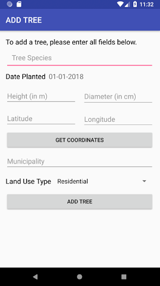
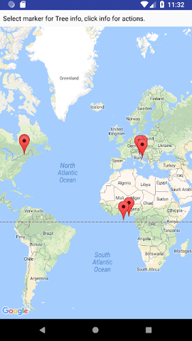

# [TreePLE System](https://github.mcgill.ca/ECSE321-2018-Winter/Project-05)
URL:  http://ecse321-5.ece.mcgill.ca:8080/

[Build Status](http://ecse321-5.ece.mcgill.ca:8081/job/Backend-Master/)

TreePLE system is a tree management system contains Java Spring backend, Web frontend and Android frontend.
## About
This is a course project for ECSE 321 course at McGill University, Winter 2018 Semester, instructor: Prof. Daniel Varró. The objective of this course project is to create a system to manage trees planted in urban environments (e.g. on streets, in parks or in residential properties), calculate the sustainability benefits of trees in an area, and assist urban planning by assessing the consequences of major urban development projects (e.g. house constructions, establishment of new parks).

This software system is subdivided into three sections:
- Java Spring backend
- Web App
- Android App

## Team members
* [**Yan Ren**](https://www.linkedin.com/in/yan-ren-ryan/), Backend and web frontend developer
* **Jimmy Khairallah**, Web frontend developer
* **Ivraj Tathgur**, Android developer
* **Hieu Chau Nguyen**, Backend developer
* **Barry Chen**, Documentation and backend testing

## Feature List
#### Backend

For more API details, please refer to [this](https://docs.google.com/document/d/10wtauv0HIld_ncVqekVK3QCDNKqeoMQRALkx9XUxbIo/edit?usp=sharing) API table
* Data initialization and update
    *   Upload data through .csv file
    *   Update tree data within the database (e.g. for correcting information)
    *   List all (or specific subset of) trees (e.g. municipality, species)
* Reporting
    *   Report if a tree is planted or cut down
    *   Mark trees which are diseased or to be cut down
* Sustainability attributes and forecasting
    *   Automatically calculate sustainability attributes when "List all Trees"
    *   Forecast species to increase biodiversity index within area
    *   Forecast biodiversity index and carbon sequestration for what-if-remove a certain land type within an area
* Persistence:   store data in .xml file

#### Web App

* HomeContainer
    * Home page with no functionalities
* ListTreesContainer
    * Lists trees from database with attributes in a table
    * Filter conditions by finding all trees in specific municipality
    * Shows biodiversity index and carbon sequestration
* UploadFileContainer
    * Prompts user to upload a .csv file with data for trees and sends it back to backend
* UpdateTreeDataContainer
    * Updates tree attributes for a tree of the user's choosing and updates data in backend
* ForecastingContainer
    * Forecasting ability to show species available in user's choosing of municipality, showing as well biodiversity index
    * Forecasting ability to show all species available in user's choosing of municipality, while choosing what land type to hide, showing as well biodiversity index

#### Android App
A "login" starting screen, where the user identifies their name and user type. Features are then dependent on user type.

Add Tree (Local Resident and Scientist)
* Shown in Figure 1, the User must enter all fields before adding a tree. If not, an alert is displayed.

<p align="center"><br><b>Figure 1: AddTree Activity</b></br></p>

Cut Tree (Local Resident and Scientist)
* Users can narrow a search for trees based on species and municipalities. After doing so, and clicking the "LIST TREES" button, all trees fitting the user's criteria is mapped to Google Maps using Google's Maps API service (Figure 2). See "List Trees" below for rest of functionality.

Mark Tree (Scientist)
* The ability to mark a tree for removal or disease. The activity path is the same as *Cut Tree*.

List Trees (Local Resident and Scientist)
* Functionality is dependent on user type. For local residents, it will only show trees with a removable status (marked for cut, or diseased), and for a Scientist it will show all trees, regardless of status.
* when a tree's info window is clicked, a local resident only has the option to remove a tree. A Scientist additionally has the option to mark a tree for cutdown and mark a tree for disease.

For all acitivities using REST API services, an appropriate error message is displayed if one is returned by the response.

<p align="center"><br><b>Figure 2: Maps Activity</b></br></p>

## Setup instructions
These instructions will get you a copy of the project and run on your local machine for development and testing purposes.
#### Backend
Install Java 8 and Eclipse.

Install Eclipse plugins "Buildship Gradle Integration 2.0" and "Spring Tools Suite" from the Eclipse Marketplace.

The source code can be found in the folder [TreePLE-Spring](https://github.mcgill.ca/ECSE321-2018-Winter/Project-05/tree/master/TreePLE-Spring)
To run backend locally:
```
    1. download the backend source code
    2. open eclipse, import "TreePLE-Spring" folder as a gradle project.
    3. open src/ca/mcgill/ecse321/treeple/TreePLESpringApplication.java.
    4. right click on this page, choose "Run as"->"Java application".
    5. should see "server started" in the console.
    6. now the local backend can be accessed through http://localhost:8088
```

The backend is also deployed to http://ecse321-5.ece.mcgill.ca:8080 (see [production server](#using-production-server) on how to access).

#### Web App
Install Node.js and npm. Instructions at https://nodejs.org/en/ and https://www.npmjs.com/get-npm.

The source code can be found in the folder [TreePLE-Web](https://github.mcgill.ca/ECSE321-2018-Winter/Project-05/tree/master/treeple-frontend)<br/>
To run frontend locally:
```
    1. Make sure the backend is running locally
    2. Download the frontend source code from the link above
    3. Open terminal and cd into the folder 'treeple-frontend'
    4. Run on the terminal 'npm install' to install node_modules
    5. Upon successful completion, run 'npm start' and default web browser will view the frontend, we recommend using Firefox or Chrome
    6. For development purposes, we recommend WebStorm (File->Open and choose the folder 'treeple-frontend'), or you can use your text editor of choice.
```
To use our [production server](#using-production-server) at http://ecse321-5.ece.mcgill.ca:8080/, navigate to treeple-frontend in terminal and execute the following commands,
* npm install -g http-server (only needs to be executed once on machine)
* npm install
* npm run build
* http-server build

The web app is also deployed to http://ecse321-5.ece.mcgill.ca:8087 (see [production server](#using-production-server) on how to access the website).

#### Android App
Download Android Studio (minimum Android SDK of 23).

The source code can be found in the folder [TreePLE-Android](https://github.mcgill.ca/ECSE321-2018-Winter/Project-05/tree/master/TreePLE-Android).<br/>

To run Android locally:
```
    1. Make sure the backend is running locally.
    2. Download the frontend source code from the link above.
    3. Open the project in Android Studio.
    4. Download Studio's built-in emulator. You can also connect to an Android VM or device (instructions available at https://developer.android.com/studio/command-line/adb.html).
    Note: Emulators/devices need to be running at minimum Android API 23 for the app to work.
    5. Click 'Run' and choose the emulator you want to use.
```
To use the [production server](#using-production-server) at http://ecse321-5.ece.mcgill.ca:8080/, comment/uncomment the appropriate lines in HttpUtils.java.

#### How to upload initial tree data
If you are running the backend system for the first time on your computer, you probably won't see the tree data in the frontend. We encourage you to use the .csv files from [here](https://github.mcgill.ca/ECSE321-2018-Winter/Project-05/tree/master/TreePLE-Spring/textDataFiles) to upload the initial tree data through our frontend "Upload Trees" page. *NOTE: Only upload one file at a time. If you modify the file content, please follow our predefine header and save file as .csv format*

#### Using production server
To access the production server, you must have McGill credentials and be on McGill's network. Instructions for using McGill's VPN service can be found [here](http://kb.mcgill.ca/kb/?ArticleId=1212&source=article&c=12&cid=2).

## Project management report
#### Main responsibilities
| Name             | Role                                  | Main Responsibilities                                           |
| ---------------- |:-------------------------------------:| :-------------------------------------------------------------- |
| Barry Chen       | Documentation, Backend testing        | Provide documentation for each deliverable, and backend testing |
| Jimmy Khairallah | Frontend Developer                    | Implement web frontend                                          |
| Hieu Chau Nguyen | Documentation, Backend testing        | Provide documentation for each deliverable, and backend testing |
| Ryan Ren         | Backend Developer, Frontend developer | Implement backend, frontend debug                               |
|Ivraj Tathgur     | Android Developer                     | Implement Android Application                                   |
#### Project Iterations and Hourly Effort
Deliverable 1 Requirements and Domain Modeling. Meeting #1.

| Name             | Tasks                                                                                                                   | Hours |
|------------------|-------------------------------------------------------------------------------------------------------------------------|-------|
| Barry Chen       | Traceability of use cases to requirements, Demonstration of individual and teamwork, Work plan for remaining iterations | 12    |
| Yan Ren          | Functional and non-functional system requirements, Requirements-level activity diagram for entire scenario              | 12    |
| Jimmy Khairallah | Functional and non-functional system requirements                                                                       | 12    |
| Ivraj Tathgur    | Use case diagram(s) with Actors, Use case specifications                                                                | 12    |
| Hieu Chau Nguyen | Domain model in Umple and class diagram, Domain-level statechart for class Tree                                         | 12    |

Deliverable 2: Architecture and Design Specification with Prototype. Meeting #2.

| Name             | Tasks                                                                                                                                        | Hours |
|------------------|----------------------------------------------------------------------------------------------------------------------------------------------|-------|
| Barry Chen       | Description of architecture of proposed solution with a block diagram                                                                        | 14    |
| Yan Ren          | Description of detailed design of proposed solution including case diagram, initial backend prototype                                        | 18    |
| Jimmy Khairallah | Frontend; ListAllTrees function that loads all trees with its attributes into a table                                                        | 14    |
| Ivraj Tathgur    | Android; Main activity layoutAddTree layout (includes Tree attribute inputs and working datePicker, getLocation)RemoveTree layout (listView) | 16    |
| Hieu Chau Nguyen | Update the domain model and description of the implementation of “Plant All Tree” and “List All Tree“                                        | 12    |

Deliverable 3: Quality Assurance Plan. Meeting #3.

| Name             | Tasks                                                                                                                                                                                                                                                                                                                                                                                                                               | Hours |
|------------------|-------------------------------------------------------------------------------------------------------------------------------------------------------------------------------------------------------------------------------------------------------------------------------------------------------------------------------------------------------------------------------------------------------------------------------------|-------|
| Barry Chen       | Documentation of unit test plan and system test plan;<br> Implementation of TreePLE Controller Class unit test cases                                                                                                                                                                                                                                                                                                                    | 20    |
| Yan Ren          | Backend implementation: Report if a tree is planted or cut down by the owner; Report trees which are diseased or to be cut down; List all (or specific subset of) trees; Load initial tree data from a text file; <br>Implement test case for persistence and business layer; <br>Persistence layer positive test case; “findAllTrees” method one positive test case, one negative test case; “loadFromFile” method one positive test case | 60    |
| Jimmy Khairallah | Implementation of TreePLE Controller Class unit test cases; Frontend implementation                                                                                                                                                                                                                                                                                                                                                 | 20    |
| Ivraj Tathgur    | Implemented some backend unit test cases; <br>Reworked some service methods; Android layout modifications.                                                                                                                                                                                                                                                                                                                              | 20    |
| Hieu Chau Nguyen | Implemented some backend unit test cases; <br>Debugging the backend using the test cases; <br>Documentation on Integration test plan and System test plan.                                                                                                                                                                                                                                                                                  | 21    |

Deliverable 4: Release Pipeline Plan. Meeting #4

| Name             | Tasks                                                                                                                                                                                                                                                                                                                                                                                                                           | Hours |
|------------------|---------------------------------------------------------------------------------------------------------------------------------------------------------------------------------------------------------------------------------------------------------------------------------------------------------------------------------------------------------------------------------------------------------------------------------|-------|
| Barry Chen       | Release pipeline plan                                                                                                                                                                                                                                                                                                                                                                                                           | 14    |
| Yan Ren          | Backend implementation:  Add “caclulateSustainabilityAttributes” in business layer.  Add dtos for “SustainabilityAttributes” and “TreeGroup”. In rest layer, merge “SustainabilityAttributes” and “TreeGroup” into the response of “/trees” Add api “/forcasting/biodiversity” <br>Implement release pipeline: Create jenkins job “Backend-Master” that builds and deploy “TreePLE-Spring” from the github repository <br>Documentation | 30    |
| Jimmy Khairallah | Frontend development                                                                                                                                                                                                                                                                                                                                                                                                            | 15    |
| Ivraj Tathgur    | Jenkins (build and deployment) implementation; <br>Configuring frontend port assignments; Documentation                                                                                                                                                                                                                                                                                                                             | 30    |
| Hieu Chau Nguyen | Release pipeline; Tomcat configuration; Documentation                                                                                                                                                                                                                                                                                                                                                                           | 16    |

Deliverable 5 Presentation. Meeting #5

| Name             | Tasks                                                              | Hours |
|------------------|--------------------------------------------------------------------|-------|
| Barry Chen       | Presentation preparation and practice                              | 8     |
| Yan Ren          | Presentation preparation and practice; Backend forecating APIs     | 12    |
| Jimmy Khairallah | Presentation preparation and practice; Frontend features and debug | 12    |
| Ivraj Tathgur    | Presentation preparation and practice; Android features and debug  | 12    |
| Hieu Chau Nguyen | Presentation preparation and practice                              | 8     |

Deliverable 6 Final. Meeting #6

| Name             | Tasks                                                   | Hours |
|------------------|---------------------------------------------------------|-------|
| Barry Chen       | Documentation                                           | 7     |
| Yan Ren          | Backend Documentation; Frontend forecasting improvement | 12    |
| Jimmy Khairallah | Web App Documentation; Frontend design improvement   |  3     |
| Ivraj Tathgur    | Android Documentation; Fix certain features; Coding cleaning                  | 10      |
| Hieu Chau Nguyen | Documentation; Backend testing                          |  8     |

Project Total Hours Effort

| Name             | Hours |
|------------------|-------|
| Barry Chen       |  75   |
| Yan Ren          |  144  |
| Jimmy Khairallah |  76   |
| Ivraj Tathgur    |  100  |
| Hieu Chau Nguyen |  77   |

#### Overview of major project iterations and progress

| Iterations | Web Frontend                                                                | Android                                                                                                                             | Backend                                                                                                                                                                                                                                               |
|------------|-----------------------------------------------------------------------------|-------------------------------------------------------------------------------------------------------------------------------------|-------------------------------------------------------------------------------------------------------------------------------------------------------------------------------------------------------------------------------------------------------|
| 1          | Use case diagram(s) with Actors, Use case specifications                    | Use case diagram(s) with Actors, Use case specifications                                                                            | Domain model in Umple and class diagram                                                                                                                                                                                                               |
| 2          | ListAllTrees function that loads all trees with its attributes into a table | Main activity layoutAddTree layout (includes Tree attribute inputs and working datePicker, getLocation)RemoveTree layout (listView) | Initial backend prototype                                                                                                                                                                                                                             |
| 3          | FileUploading page                                                          | Reworked some service methods; Android layout modifications.                                                                        | APIs:Report if a tree is planted or cut down by the owner; Report trees which are diseased or to be cut down; List all (or specific subset of) trees; Load initial tree data from a text file;                                                        |
| 4          | Tree data update page                                                       | Google Map integration                                                                                                              | Add “caclulateSustainabilityAttributes” in business layer. Add dtos for “SustainabilityAttributes” and “TreeGroup”. In rest layer, merge “SustainabilityAttributes” and “TreeGroup” into the response of “/trees”. Add api “/forcasting/biodiversity” |
| 5          | Debugging and Backend integration                                           | Debugging and Backend integration                                                                                                   | Integration with frontend; Debugging                                                                                                                                                                                                                  |
| 6          | Forecasting page                                                            |                                                                                                                                     | Integration with frontend; Debugging through test case                                                                                                                                                                                                |


## License
This project is under MIT: http://rem.mit-license.org. Team members wish to keep the repository private.
